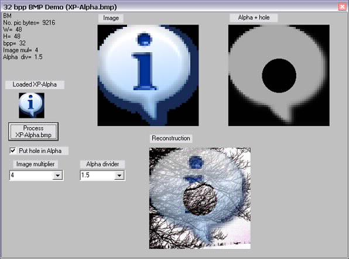



## Demo of 32bpp bitmap

### Description

Demo of 32bpp bitmap by Robert Rayment. Simple demonstration of manipulating a 32bpp BMP file. Zip 83 KB.
 
### More Info
 
Just run

             |
---                |---
**Submitted On**   |2007-02-10 20:09:08
**By**             |[Robert Rayment](https://github.com/Planet-Source-Code/PSCIndex/blob/master/ByAuthor/robert-rayment.md)
**Level**          |Beginner
**User Rating**    |5.0 (30 globes from 6 users)
**Compatibility**  |VB 6\.0
**Category**       |[Graphics](https://github.com/Planet-Source-Code/PSCIndex/blob/master/ByCategory/graphics__1-46.md)
**World**          |[Visual Basic](https://github.com/Planet-Source-Code/PSCIndex/blob/master/ByWorld/visual-basic.md)
**Archive File**   |[Demo\_of\_322047392112007\.zip](https://github.com/Planet-Source-Code/robert-rayment-demo-of-32bpp-bitmap__1-67839/archive/master.zip)

### API Declarations

Mainly StretchDIBits

